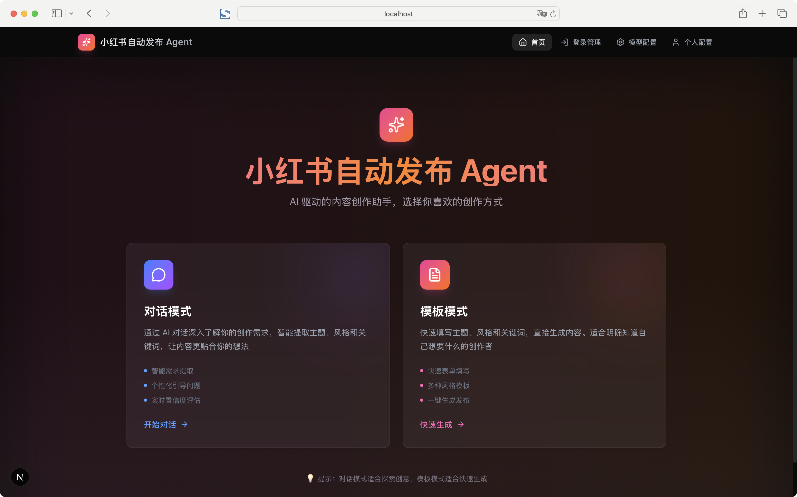
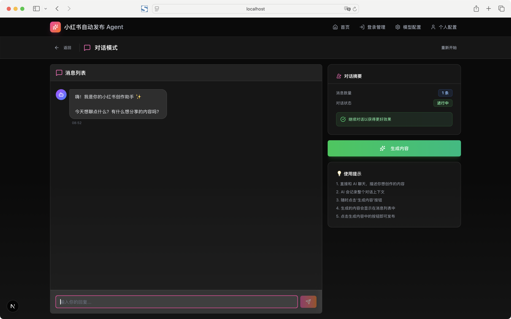
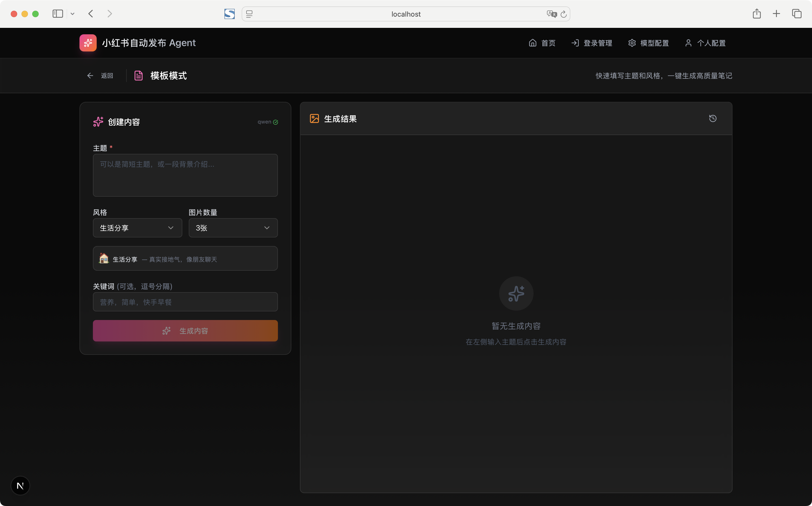

# 小红书自动发文 Agent

<div align="center">


🤖 多模型接入 · AI 生成内容 · 自动发布 · 可视化操作界面

</div>

## ✨ 功能特性

- 💬 **双模式创作**: 对话模式（AI 引导）+ 模板模式（快速填写）
- 📝 **智能内容生成**: AI 自动生成标题、正文、话题标签（JSON 结构化输出）
- 🖼️ **图片生成**: 通义万相，CogView, DALL-E, MiniMax
- 🎬 **视频生成**: MiniMax Video
- 🌐 **可视化界面**: Next.js Web UI，支持内容预览和一键发布
- ⚙️ **配置管理**: 模型配置、用户配置、登录管理独立页面
- 🤖 **自动化发布**: 浏览器自动化，Cookie 持久化登录
- 🎨 **7 种内容风格**: 清新自然、专业干货、生活分享、种草推荐、情感共鸣、幽默搞笑、文艺复古
- 📝 **提示词工程**: 独立的 JSON 配置，支持热更新

## 🚀 快速开始

### 1. 安装依赖

```bash
# 安装后端依赖
npm install

# 安装 Web 依赖
cd web
npm install
cd ..
```

### 2. 启动应用

**方式 1：一键启动（推荐）**
```bash
./start.sh
```
这会同时启动后端服务（:3001）和 Web 应用（:3000）

**方式 2：分别启动**
```bash
# 终端 1：启动后端服务
npm run server

# 终端 2：启动 Web 应用
cd web
npm run dev
```

访问 http://localhost:3000

### 3. 配置模型 API Key

**方式 1：通过 Web 界面配置（推荐）**

启动应用后访问 http://localhost:3000/settings 在"模型配置"标签页填写：
- 文本模型提供商和 API Key
- 图片模型提供商和 API Key

**方式 2：手动创建配置文件**

复制示例配置文件：

```bash
cp config/model-config.example.json config/model-config.json
```

编辑 `config/model-config.json` 文件：

```json
{
  "textProvider": "qwen",
  "textApiKey": "your_qwen_api_key",
  "imageProvider": "qwen",
  "imageApiKey": "your_qwen_api_key"
}
```

**支持的模型提供商：**
- 文本：`openai`, `deepseek`, `qwen`, `glm`, `minimax`, `anthropic`
- 图片：`openai`, `qwen`, `glm`, `minimax`
- 视频：`minimax`

> 💡 提示：配置文件 `config/model-config.json` 不会被提交到 Git，请妥善保管

### 4. 登录小红书（首次使用）

```bash
npm run test:login
```

在浏览器中完成登录，Cookie 会自动保存到 SQLite 数据库。

> 💡 **数据迁移**: 如果你之前使用过旧版本，可以运行 `npm run migrate` 将配置文件数据迁移到 SQLite 统一存储。详见 [SQLite 迁移指南](docs/SQLITE_MIGRATION.md)。

### 5. 配置用户信息（可选）

访问 http://localhost:3000/settings 配置：
- 个人背景（博主名称、定位、目标受众）
- 内容偏好（常用话题、关键词、禁用词）
- 发布设置（发布时间、频率、自动发布）

## 📁 项目结构

```
xiaohongshu-agent/
├── src/                      # 后端核心代码
│   ├── agent.ts              # 核心 Agent 类
│   ├── adapters/             # 模型适配器
│   │   ├── openai.ts         # OpenAI (GPT + DALL-E)
│   │   ├── deepseek.ts       # DeepSeek
│   │   ├── qwen.ts           # 通义千问 + 通义万相
│   │   ├── glm.ts            # 智谱 GLM + CogView
│   │   ├── minimax.ts        # MiniMax (文本 + 图片 + 视频)
│   │   └── anthropic.ts      # Anthropic Claude
│   ├── generators/           # 内容生成器
│   │   ├── text.ts           # 文本生成
│   │   └── image.ts          # 图片生成
│   ├── content/              # 内容生成逻辑
│   │   └── generator.ts      # AI 内容生成（JSON 解析）
│   ├── config/               # 配置管理
│   │   ├── user-profile.ts   # 用户配置加载器
│   │   └── user-profile.example.json  # 用户配置模板
│   ├── prompts/              # 提示词工程
│   │   ├── loader.ts         # 提示词加载器
│   │   └── prompts.json      # 提示词模板配置
│   ├── core/                 # 核心模块
│   │   ├── orchestrator.ts   # 统筹者
│   │   ├── publisher.ts      # 发布器
│   │   ├── browser.ts        # 浏览器管理
│   │   └── cookie-manager.ts # Cookie 管理
│   ├── cli.ts                # 命令行工具
│   └── test-login.ts         # 登录测试脚本
├── web/                      # Next.js Web 界面
│   ├── src/
│   │   ├── app/
│   │   │   ├── page.tsx      # 主页面
│   │   │   ├── settings/     # 用户配置页面
│   │   │   └── api/          # API 路由
│   │   └── components/ui/    # UI 组件
│   └── package.json
├── scripts/
│   └── install-browser.js    # 浏览器安装脚本
├── data/
│   └── agent.db              # SQLite 数据库（.gitignore，统一存储所有配置）
├── config/
│   ├── cookies.example.json  # Cookie 配置模板
│   ├── model-config.example.json  # 模型配置模板
│   └── user-profile.example.json  # 用户配置模板
├── prompts/
│   └── prompts.json          # 提示词模板配置
├── .env.example              # 环境变量示例
└── start.sh                  # 一键启动脚本
```

## 🎨 Web 界面功能

### 首页 - 模式选择（http://localhost:3000）



应用提供两种创作模式，满足不同场景需求：

#### 🗨️ 对话模式（推荐）
- **智能需求提取**: 通过 AI 对话深入了解你的创作需求
- **个性化引导**: AI 会根据你的回答提出针对性问题
- **实时置信度评估**: 系统评估信息完整度，确保生成质量
- **适用场景**: 创作灵感模糊、需要 AI 帮助梳理思路



#### 📝 模板模式（快速）
- **快速表单填写**: 直接输入主题、风格、关键词
- **7 种内容风格**: 清新自然、专业干货、生活分享、种草推荐、情感共鸣、幽默搞笑、文艺复古
- **图片数量可调**: 1-9 张图片自由选择
- **一键生成发布**: 填写完成后直接生成并发布
- **适用场景**: 明确知道创作方向，追求效率



### 配置管理

配置功能已拆分为两个独立页面，便于管理：

#### 模型配置（http://localhost:3000/settings）
- **文本模型配置**: 选择提供商（OpenAI、DeepSeek、通义千问、智谱 GLM、MiniMax、Anthropic）
- **图片模型配置**: 选择提供商（OpenAI、通义万相、CogView、MiniMax）
- **API Key 管理**: 安全存储，显示时自动脱敏
- **配置测试**: 一键测试 API Key 有效性

#### 用户配置（http://localhost:3000/profile）
- **个人背景**: 博主名称、定位、描述、目标受众、文字风格
- **内容偏好**:
  - 常用话题（标签管理）
  - 推荐关键词
  - 禁用词列表
- **发布设置**:
  - 发布时间偏好
  - 发布频率
  - 自动发布开关
  - 人工审核开关

#### 登录管理（http://localhost:3000/login）
- **网页登录**: 点击按钮自动打开浏览器扫码登录
- **命令行登录**: 支持终端运行 `npm run test:login`
- **状态检查**: 实时显示登录状态和 Cookie 有效性
- **刷新功能**: 一键刷新登录状态

## 💻 命令行工具

```bash
# 测试生成（只生成不发布）
npm run test:publish

# 生成并发布
npm run publish:content -- -t "主题" -s "风格"

# 完整参数
npm run publish:content -- \
  -t "健康早餐" \
  -s "清新自然" \
  -k "营养，简单，快手" \
  -i 3 \
  --no-publish  # 只生成不发布

# 测试登录
npm run test:login

# 健康检查
npm run health
```

## 🎯 内容风格

| 风格 | 特点 | 适用场景 |
|------|------|----------|
| 🌸 清新自然 | 温柔治愈，如春风拂面 | 日常生活、美食、穿搭 |
| 📚 专业干货 | 结构清晰，信息密度高 | 知识分享、教程、攻略 |
| 📷 生活分享 | 真实接地气，像朋友聊天 | 日常记录、Vlog 文案 |
| 🌟 种草推荐 | 真诚推荐，突出亮点 | 好物推荐、产品测评 |
| 💭 情感共鸣 | 细腻走心，引发共鸣 | 情感故事、成长感悟 |
| 😂 幽默搞笑 | 轻松有趣，段子手风格 | 搞笑日常、吐槽 |
| 📜 文艺复古 | 文艺范儿，复古调调 | 旅行、摄影、艺术 |

## 🔧 高级配置

### 自定义提示词

编辑 `prompts/prompts.json` 自定义提示词模板：

```json
{
  "styles": {
    "自定义风格": {
      "name": "自定义风格",
      "description": "风格描述",
      "systemPrompt": "系统提示词",
      "userPromptTemplate": "用户提示词模板"
    }
  }
}
```

修改后无需重启，自动生效。

### 自定义用户配置

编辑 `config/user-profile.json`（首次使用可从模板复制）：

```bash
cp config/user-profile.example.json config/user-profile.json
```

或通过 Web 界面 http://localhost:3000/settings 在线编辑。

## 🔐 安全说明

- ✅ Token 保存在 `.secrets/github.env`，已加入 `.gitignore`
- ✅ Cookie 保存在 `data/agent.db` (SQLite)，已加入 `.gitignore`
- ✅ 用户配置保存在 SQLite 数据库，已加入 `.gitignore`
- ✅ 仓库设置为 Private，仅组织成员可见
- ⚠️ 不要将 Cookie 和 Token 泄露给他人

## 📝 使用示例

### 示例 1：对话模式生成笔记（推荐）

1. 访问 http://localhost:3000
2. 选择"对话模式"
3. 与 AI 对话描述你的创作需求：
   ```
   用户：我想写一篇关于健康早餐的笔记
   AI：好的！能告诉我更多细节吗？比如是针对减脂人群还是上班族？
   用户：主要是上班族，要快手简单的
   AI：明白了。你希望内容风格是什么样的？
   用户：清新自然一点
   ```
4. AI 自动提取主题、风格、关键词
5. 确认信息后点击"生成内容"
6. 预览满意后点击"发布到小红书"

### 示例 2：模板模式快速生成

1. 访问 http://localhost:3000
2. 选择"模板模式"
3. 填写表单：
   - 主题：`健康早餐`
   - 风格：`清新自然`
   - 关键词：`营养，简单，快手`
   - 图片数量：3 张
4. 点击"生成内容"
5. 预览满意后点击"发布到小红书"

### 示例 3：命令行发布

```bash
# 生成并发布一篇关于"旅行攻略"的笔记
npm run publish:content -- -t "旅行攻略" -s "专业干货" -k "自由行，预算，必去景点"

# 只生成不发布（预览内容）
npm run test:publish
```

### 示例 4：配置用户背景

1. 访问 http://localhost:3000/profile
2. 填写博主信息：
   - 名称：伦哥
   - 定位：生活美学博主
   - 描述：热爱生活的理工男
3. 添加常用话题：`日常生活`、`好物推荐`、`美食探店`
4. 添加禁用词：`最`、`第一`、`绝对`
5. 点击"保存配置"

## 🛠️ 开发说明

### 添加新模型

1. 在 `src/adapters/` 创建新适配器（如 `custom.ts`）
2. 继承 `TextModelAdapter` 或 `ImageModelAdapter`
3. 在 `src/adapters/index.ts` 注册
4. 更新配置文件

### 添加新风格

1. 编辑 `prompts/prompts.json`
2. 在 `styles` 中添加新风格配置
3. 无需重启，自动生效

### 测试

```bash
# 测试登录
npm run test:login

# 测试生成
npm run test:publish

# 健康检查
npm run health
```

## 📊 发布频率建议

- ⚠️ 每天不超过 3-5 篇
- ⚠️ 间隔 30 分钟以上
- ⚠️ 避免被判定为营销号
- ✅ 建议开启人工审核（在配置页面设置）

## ❓ 常见问题

### Q: 提示"登录已过期"怎么办？
A: 运行 `npm run test:login` 重新登录，Cookie 会自动更新。

### Q: 内容生成失败？
A: 检查 API Key 是否正确配置，确保账户有余额。

### Q: 图片生成超时？
A: 图片生成设置了 30 秒超时，失败会自动跳过，不影响文本生成。

### Q: 如何修改提示词？
A: 编辑 `prompts/prompts.json`，保存后自动生效。

### Q: 用户配置保存在哪？
A: `config/user-profile.json`，已通过 `.gitignore` 保护，不会提交到 Git。

## 🤝 贡献

欢迎提交 Issue 和 Pull Request！

## 📄 License

MIT

---

**创建者**: Amlun

**组织**: jingjiansoft

**GitHub**: https://github.com/jingjiansoft/xiaohongshu-agent

**文档最后更新**: 2026-03-11
